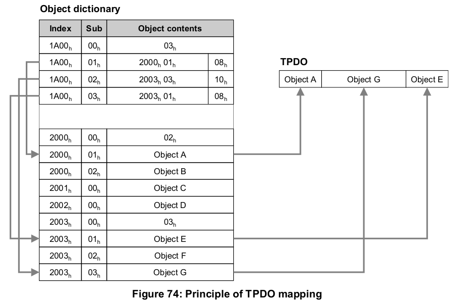

# CAN_Open_lite_PIC18

CAN_Open_lite 

SDO ERROR CODE
0503 0000h	Toggle bit not alternated.
0504 0000h	SDO protocol timed out.
0504 0001h	Client/server command specifier not valid or unknown.
0504 0002h	Invalid block size (block mode only).
0504 0003h	Invalid sequence number (block mode only).
0504 0004h	CRC error (block mode only).
0504 0005h	Out of memory.
0601 0000h	Unsupported access to an object.
0601 0001h	Attempt to read a write only object.
0601 0002h	Attempt to write a read only object.
0602 0000h	Object does not exist in the object dictionary.
0604 0041h	Object cannot be mapped to the PDO.
0604 0042h	The number and length of the objects to be mapped would exceed PDO length.
0604 0043h	General parameter incompatibility reason.
0604 0047h	General internal incompatibility in the device.
0606 0000h	Access failed due to an hardware error.
0607 0010h	Data type does not match, length of service parameter does not match
0607 0012h	Data type does not match, length of service parameter too high
0607 0013h	Data type does not match, length of service parameter too low
0609 0011h	Sub-index does not exist.
0609 0030h	Invalid value for parameter (download only).
0609 0031h	Value of parameter written too high (download only).
0609 0032h	Value of parameter written too low (download only).
0609 0036h	Maximum value is less than minimum value.
060A 0023h	Resource not available: SDO connection
0800 0000h	General error
0800 0020h	Data cannot be transferred or stored to the application.
0800 0021h	Data cannot be transferred or stored to the application because of local control.
0800 0022h	Data cannot be transferred or stored to the application because of the present device state.
0800 0023h	Object dictionary dynamic generation fails or no object dictionary is present (e.g.
				object dictionary is generated from file and generation fails because of an file error).
0800 0024h	No data available

Block rele 220v 12 segmentov.(PIC18F25K80)

TFTpanel ILI9486 (PIC18F26K80)
